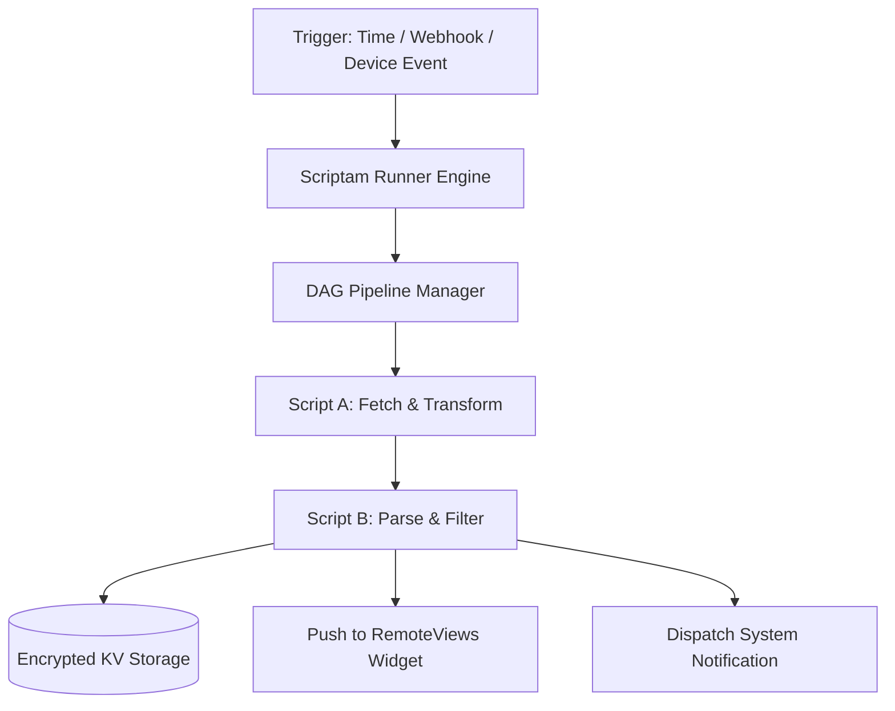
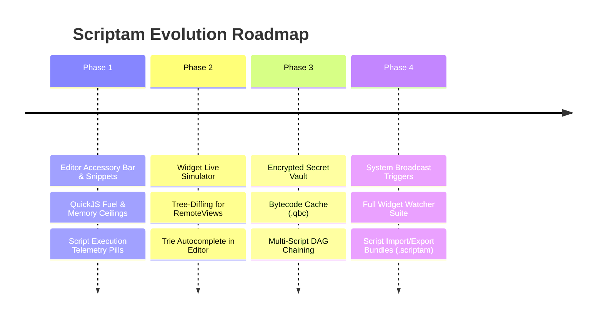

# Scriptam Future Roadmap: Architecture, DSA & Feature Specification

This engineering blueprint establishes the upcoming development iterations for **Scriptam**, focusing on runtime performance, algorithmic foundations, automation workflows, UI/UX ergonomics, widget monitoring, and developer tooling.

---

## 1. Performance & Runtime Optimization

```text
┌────────────────────────────────────────────────────────────────────────┐
│                        Execution Pipeline                              │
├─────────────────────┬──────────────────────┬───────────────────────────┤
│  1. Bytecode Cache  │  2. Fast Native IPC  │  3. Fuel & Mem Sandboxing │
│  Pre-compiled Quick │  Zero-copy binary /  │  `JS_SetInterruptHandler` │
│  JS bytecode blobs  │  typed primitive     │  hard CPU cycle budget &  │
│  (.qbc) on disk     │  deserialization     │  32MB RAM memory ceiling  │
└─────────────────────┴──────────────────────┴───────────────────────────┘
```

### 1.1 QuickJS Bytecode Pre-Compilation (`.qbc`)
- **Current State**: [ScriptEngineManager.kt](file:///c:/Users/GSB/Desktop/Projects_Master/Personal/Scriptam/app/src/main/java/com/scriptam/app/core/ScriptEngineManager.kt) parses and compiles raw JavaScript text via `quickJs.evaluate(script)` on every run.
- **Optimization Strategy**:
  - Compile scripts to QuickJS bytecode (`JS_Eval(..., JS_EVAL_FLAG_COMPILE_ONLY)`) and serialize the binary to a `.qbc` cache on disk upon script save.
  - When invoked from [ScriptWorker.kt](file:///c:/Users/GSB/Desktop/Projects_Master/Personal/Scriptam/app/src/main/java/com/scriptam/app/worker/ScriptWorker.kt) or home-screen widgets, load and execute the pre-compiled bytecode directly.
  - **Expected Impact**: Cuts cold start and background execution latency by **60–75%**, reducing Android CPU wake locks and battery drain.

### 1.2 Resource Sandboxing & Fuel Budget
- **Current State**: Coroutines enforce a wall-clock timeout via `withTimeout()`, but an uncooperative CPU loop (`while(true){}`) can pin the single-threaded dispatcher thread until cancelled.
- **Optimization Strategy**:
  - Expose a QuickJS instruction count interrupt handler (`JS_SetInterruptHandler`) with a configured "fuel" limit (e.g., maximum 10,000,000 bytecode instructions per execution).
  - Set a hard memory ceiling via `JS_SetMemoryLimit` (e.g., 32 MB) to prevent runaway memory allocation or memory exhaustion.

### 1.3 Fast Native Bridge Serialization
- **Current State**: [WidgetPayloadParser.kt](file:///c:/Users/GSB/Desktop/Projects_Master/Personal/Scriptam/app/src/main/java/com/scriptam/app/widget/model/WidgetPayloadParser.kt) evaluates `widgetUI()` via `JSON.stringify()` in JS, passes the serialized string across JNI to Kotlin, and parses it with `org.json.JSONObject`.
- **Optimization Strategy**:
  - Use direct primitive binding through [AndroidBridge.kt](file:///c:/Users/GSB/Desktop/Projects_Master/Personal/Scriptam/app/src/main/java/com/scriptam/app/bridge/AndroidBridge.kt) or streaming JSON tokens to reduce GC allocation pressure on periodic runs.

---

## 2. DSA Foundations (Algorithms & Data Structures)

| Domain | Data Structure / Algorithm | Technical Application in Scriptam |
| :--- | :--- | :--- |
| **Editor Autocomplete** | **Compressed Radix Tree (Trie)** | Fast prefix matching ($O(k)$ where $k = \text{query length}$) for global APIs (`Native.*`, `Widget.*`, JS keywords) in the mobile editor. |
| **Widget UI Updates** | **Hierarchical Tree Diffing (VDOM)** | Diff previous widget node tree against new payload to emit minimal `RemoteViews` updates, eliminating home-screen flicker. |
| **Workflow Pipelines** | **Directed Acyclic Graph (DAG) + Topological Sort** | Chain scripts ($A \rightarrow B \rightarrow C$) with cycle detection via Kahn's algorithm or DFS. |
| **API Throttling** | **Token Bucket / Leaky Bucket** | Rate-limit outgoing requests in [NetworkModule.kt](file:///c:/Users/GSB/Desktop/Projects_Master/Personal/Scriptam/app/src/main/java/com/scriptam/app/bridge/NetworkModule.kt) to prevent scripts from hitting external rate limits. |
| **Telemetry & Watcher** | **Sliding Window Ring Buffer** | Track rolling execution metrics (latency p50/p95, memory footprint, success/fail counts) in $O(1)$ time and bounded memory. |

### Tree-Diffing for RemoteViews
Instead of purging and rebuilding the entire `RemoteViews` layout hierarchy:
1. Assign stable keys to widget elements (`Widget.card({ key: "crypto_btc" })`).
2. Run tree diff between the previous and new AST.
3. Apply `setViewVisibility`, `setTextViewText`, or `removeAllViews` surgically to minimize IPC payload sent to `com.android.systemui`.

---

## 3. Workflow & Script Orchestration



1. **Multi-Script Pipelines**:
   - Allow scripts to invoke child scripts: `Native.runScript("data-parser", { rawData })`.
   - Pipeline visualizer in Jetpack Compose showing data flow between nodes.
2. **Event-Driven Triggers**:
   - **System Broadcast Listeners**: Run scripts on battery low, Wi-Fi network switch, device boot, or Bluetooth connection.
   - **Precision Alarms**: Support exact unix/cron timestamps via `AlarmManager.setExactAndAllowWhileIdle` for sub-15-minute automation tasks.
3. **Encrypted Secret Vault (`Native.secrets`)**:
   - Store sensitive API keys (OpenAI, GitHub, Telegram) in Android Keystore with AES-256-GCM.
   - Scripts read keys securely via `Native.getSecret("OPENAI_KEY")` rather than hardcoding tokens in JS files.

---

## 4. UI/UX & Mobile Ergonomics

### 4.1 Dashboard Enhancements
- **Tags & Folder Organization**: Filter scripts by tags (`#finance`, `#system`, `#iot`).
- **Execution Telemetry Pill**: Small status badge on [DashboardScreen.kt](file:///c:/Users/GSB/Desktop/Projects_Master/Personal/Scriptam/app/src/main/java/com/scriptam/app/ui/dashboard/DashboardScreen.kt) cards indicating:
  - Last run status (Green: Success, Red: Error, Amber: Timed out).
  - Runtime duration (e.g., `42ms`, `1.2s`).
- **Swipe Actions & Reordering**: Drag-and-drop ordering and customizable swipe shortcuts (Run vs Edit).

### 4.2 Material You & Micro-Interactions
- Smooth shared-element transition between [DashboardScreen.kt](file:///c:/Users/GSB/Desktop/Projects_Master/Personal/Scriptam/app/src/main/java/com/scriptam/app/ui/dashboard/DashboardScreen.kt) cards and [EditorScreen.kt](file:///c:/Users/GSB/Desktop/Projects_Master/Personal/Scriptam/app/src/main/java/com/scriptam/app/ui/editor/EditorScreen.kt).
- Subtle haptic feedback (`HapticFeedbackType.LongPress` and `TextHandleMove`) when triggering manual script runs.

---

## 5. Widget Watcher & Monitor

A dedicated in-app diagnostic center for managing active widgets on the user's home screen:

```text
┌────────────────────────────────────────────────────────┐
│               WIDGET MONITOR & SIMULATOR               │
├──────────────────────────┬─────────────────────────────┤
│  Active Widgets (3)      │  Live Device Preview        │
│  • Crypto Ticker [2x2]   │  ┌───────────────────────┐  │
│  • Weather Daily [4x2]   │  │ BTC: $64,230 (+2.4%)  │  │
│  • System RAM [2x1]      │  │ ETH: $3,450  (-0.8%)  │  │
│                          │  └───────────────────────┘  │
│  Last Run: 2m ago (18ms) │  [ Force Refresh ] [ Logs ] │
└──────────────────────────┴─────────────────────────────┘
```

1. **Interactive Widget Simulator**:
   - Preview widget layouts inside the app across all sizes (2x1, 2x2, 4x2, 4x4) before placing them on the launcher.
2. **Health Watcher**:
   - Displays real-time status of periodic [ScriptWorker.kt](file:///c:/Users/GSB/Desktop/Projects_Master/Personal/Scriptam/app/src/main/java/com/scriptam/app/worker/ScriptWorker.kt) executions.
   - Shows failure reasons, network timeouts, and raw payload inspection.
3. **Widget State History**:
   - Stores the last 10 payloads to inspect visual regressions or historical data changes.

---

## 6. Advanced Code Editor Features

In [WebViewEditor.kt](file:///c:/Users/GSB/Desktop/Projects_Master/Personal/Scriptam/app/src/main/java/com/scriptam/app/ui/editor/WebViewEditor.kt) and [index.html](file:///c:/Users/GSB/Desktop/Projects_Master/Personal/Scriptam/app/src/main/assets/editor/index.html):

### 6.1 Soft Keyboard Accessory Bar
A sticky Compose toolbar docked directly above the Android soft keyboard providing instant access to programming characters without opening symbol keyboards:
```kotlin
// [ Tab ]  [ { ]  [ } ]  [ ( ]  [ ) ]  [ [ ]  [ ] ]  [ = ]  [ > ]  [ " ]  [ ; ]  [ Undo ]  [ Redo ]
```

### 6.2 Autocomplete & Snippet Engine
- **Type Definitions (`d.ts`) / Introspection**:
  - Autocomplete completions for `Native.` (`showToast`, `fetch`, `storage`, `deviceInfo`, `clipboard`, `notifications`).
  - Autocomplete completions for `Widget.` (`card`, `list`, `row`, `column`, `badge`, `button`).
- **Built-in Snippet Library**:
  - One-tap insertion of full templates (e.g., "HTTP Fetch Widget", "Battery Alert", "Crypto Tracker").

### 6.3 Syntax Linter & Error Highlighting
- Integrate lightweight JS AST validation (e.g., Acorn or CodeMirror Linter) to highlight syntax errors with inline gutter markers before running scripts.
- **Find & Replace**: Regex-capable search bar with match highlighting and replace-all functionality.

---

## 7. Phased Implementation Roadmap



| Phase | Milestone | Primary Files Involved | Target Impact |
| :--- | :--- | :--- | :--- |
| **Phase 1** | **Editor Ergonomics & Safety** | [index.html](file:///c:/Users/GSB/Desktop/Projects_Master/Personal/Scriptam/app/src/main/assets/editor/index.html), [EditorScreen.kt](file:///c:/Users/GSB/Desktop/Projects_Master/Personal/Scriptam/app/src/main/java/com/scriptam/app/ui/editor/EditorScreen.kt), [ScriptEngineManager.kt](file:///c:/Users/GSB/Desktop/Projects_Master/Personal/Scriptam/app/src/main/java/com/scriptam/app/core/ScriptEngineManager.kt) | Keyboard accessory bar, fuel limit, and execution telemetry badge. |
| **Phase 2** | **Widget Simulator & Diffing** | [ScriptWidget.kt](file:///c:/Users/GSB/Desktop/Projects_Master/Personal/Scriptam/app/src/main/java/com/scriptam/app/widget/ScriptWidget.kt), [WidgetPayloadParser.kt](file:///c:/Users/GSB/Desktop/Projects_Master/Personal/Scriptam/app/src/main/java/com/scriptam/app/widget/model/WidgetPayloadParser.kt) | Flicker-free VDOM diffing and in-app widget preview simulator. |
| **Phase 3** | **Performance & Pipelines** | [ScriptWorker.kt](file:///c:/Users/GSB/Desktop/Projects_Master/Personal/Scriptam/app/src/main/java/com/scriptam/app/worker/ScriptWorker.kt), [AndroidBridge.kt](file:///c:/Users/GSB/Desktop/Projects_Master/Personal/Scriptam/app/src/main/java/com/scriptam/app/bridge/AndroidBridge.kt) | Bytecode `.qbc` caching, DAG execution, Keystore secret storage. |
| **Phase 4** | **Ecosystem & Watcher** | `widget/monitor/*`, `trigger/*` | Fleet-wide widget monitoring screen and event broadcast automation. |
